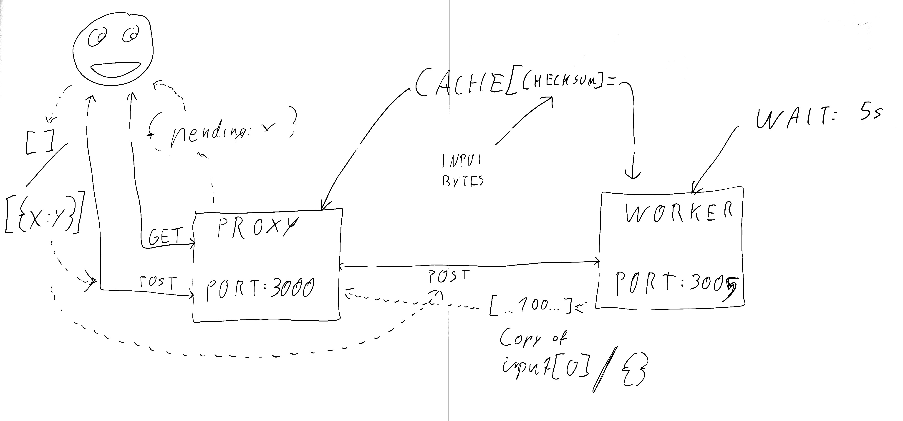

## Backend example work flow

1. Install [bun.js](https://github.com/oven-sh/bun)
2. Create two files in the bin/ folder one `server-proxy.js` and one `server-worker.js`
3. Read the documentation on how to run bun.js and start a `HTTP Server`
4. Under bin create to files for the servers, one is the "proxy", one the "worker"
5. Proxy listens on port 3000, worker on 3005
6. If proxy receives a "GET" request (path doesn't matter), it shoud return an object as JSON (`JSON.stringify({pending: server.pendingRequests})`)
7. If proxy received a "POST" request (path doesn't matter), it should create a simple checksum of the incoming bytes

```javascript
  let checkSum = 0, 
      data     = new DataView(await req.arrayBuffer());

  for (let i = 0; i < data.byteLength; i++) {
    checkSum = checkSum ^ data.getUint8(i); // Just XOR every byte of the input with the checksum
  }

```

8. Use a Map / Object as a cache by using the checksum as a key
9. If the key already exists simply return the value, if not forward the request to the "worker"

```javascript
  // Send the request to our iternal worker on port 3005
  await fetch('http://localhost:3005', { body: data.buffer } );
```

10. In the worker, read the request body (should be a json document, either empty array or an array with one element)
11. Fill the array until it has a length of 10 and use either an empty object `{}` or use the first object that was already in that array.
12. now wait 5 seconds (`await new Promise((r) => setTimeout(r, 5000));`) and return it
13. The proxy should now save that response in the cache `cache[checksum] = response` and return it to the user
14. Use the cache for the subsequent requests with the same checksum
14. Use curl to check the results: `curl -d '[]' 'http://localhost:3000'` or `curl -d '[{"some": 1337}]' 'http://localhost:3000'`

### Scribble


### Example
